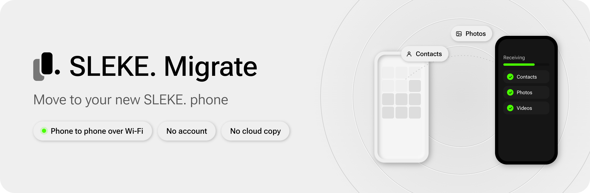

  <a href="https://migrate.sleke.io/">
    <picture>
      <source media="(prefers-color-scheme: dark)" srcset=".github/assets/banner-dark.png">
      
    </picture>
  </a>

  
  

  
  
  

**SLEKE. Migrate** moves your contacts, photos, videos and files from the phone you’re leaving to your new SLEKE. phone. The two phones talk directly over your Wi-Fi, so there’s no account to make and no cloud copy of anything you send.

You install it on your **old phone**. Your new SLEKE. phone sends you here during setup.

## How it works

| | Where | What you do |
|:-:|:--|:--|
| **1** | Old phone | Install SLEKE. Migrate from [migrate.sleke.io](https://migrate.sleke.io/). |
| **2** | New SLEKE. phone | Setup shows a pairing code. Scan it with SLEKE. Migrate to connect the phones. |
| **3** | Old phone | Pick contacts, whole albums or folders, then send. Keep both phones awake and on the same Wi-Fi until it finishes. |

## Install on Android

1. On your old phone, open [migrate.sleke.io](https://migrate.sleke.io/) and tap **Download for Android**, or get `sleke-migrate.apk` from the [latest release](https://github.com/snvd-io/sleke-migrate/releases/latest).
2. Android asks before installing from a browser. Tap **Settings**, turn on **Allow from this source**, then go back. You can turn it off again afterwards.
3. Tap **Install**. If Play Protect offers to scan the app, let it scan. Then open SLEKE. Migrate and tap **Start**.

Needs Android 9 or newer, with both phones on the same Wi-Fi.

**On an iPhone?** SLEKE. Migrate for iPhone is on its way to the App Store. Until then, your new SLEKE. phone can finish setup without it.

## Private by design

- **No account.** Nothing to sign up for, nothing to sign in to.
- **No cloud copy.** What you send goes phone to phone over your local Wi-Fi.
- **Only what you pick.** The app asks for the camera to scan, and for contacts, photos and files only when you choose them.

The Android app sends crash reports to Sentry so we can fix bugs. They never include your files. Read the full [privacy policy](https://migrate.sleke.io/privacy).

## Check your download

Each release lists the APK’s SHA-256 in its notes and ships it as `sleke-migrate.apk.sha256`. Run the command for your computer in the folder where you downloaded the APK, and compare the result.

| Computer | Command |
|:--|:--|
| macOS or Linux | `shasum -a 256 sleke-migrate.apk` |
| Windows | `certutil -hashfile sleke-migrate.apk SHA256` |
| PowerShell | `Get-FileHash sleke-migrate.apk` |

## If something goes wrong

<b>Android blocked the install, or Play Protect warned</b>

 
Open <code>sleke-migrate.apk</code> from Downloads again. When Android asks, tap Settings, turn on Allow from this source for your browser, then go back and tap Install. If Play Protect offers to scan the app, let it scan, then install.

<b>It says “That’s not a SLEKE. pairing code”</b>

 
Scan the pairing screen on the new phone, not the code that brought you to the download page. On the new phone, tap “It’s installed”, then Continue, and scan the code under “Scan with SLEKE. Migrate”.

<b>The new phone keeps waiting</b>

 
Check the old phone is on the same Wi-Fi as the new one. A guest network, or an old phone that fell back to mobile data, often can’t reach the new phone. If SLEKE. Migrate asks for local network access, allow it.

<b>My phone is older than Android 9</b>

 
SLEKE. Migrate needs Android 9 or newer. On the new phone, tap Skip for now to finish setup without it. You can still copy photos and files with a computer and a USB cable.

## Releases

Every version, with its APK and checksum, is on the [releases page](https://github.com/snvd-io/sleke-migrate/releases). See the [changelog](CHANGELOG.md) for what changed.

## License

[Apache-2.0](LICENSE)

 

  Made by <a href="https://sleke.io"><b>SLEKE.</b></a> · less phone, more life.

